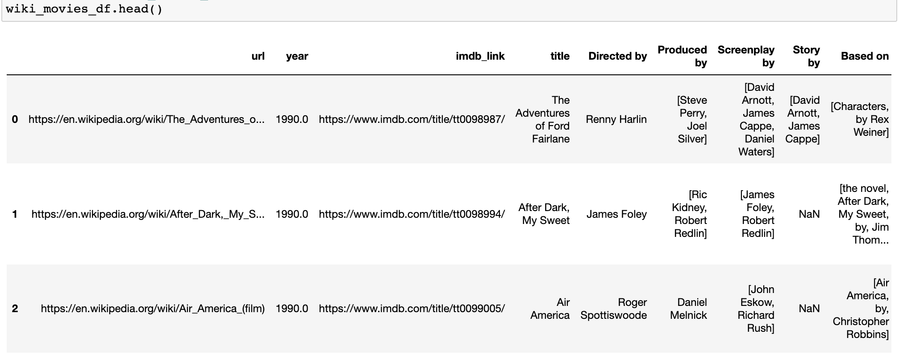
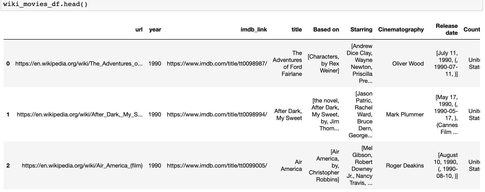
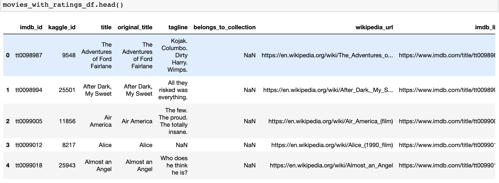
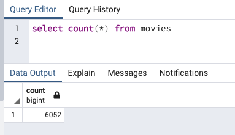

# Movies-ETL

---
## Overview 

This paper sets out to create an automated pipeline that takes in new data, performs the appropriate transformations, and loads the data into existing tables. It will refactor the code from this module to create one function that takes in the three files—Wikipedia data, Kaggle metadata, and the MovieLens rating data—and performs the ETL process by adding the data to a PostgreSQL database.

### Aim 

The aim of this paper is to:
  1) Write an ETL Function to Read Three Data Files
  2) Extract and Transform the Wikipedia Data
  3) Extract and Transform the Kaggle data
  4) Create the Movie Database

---

### Read Data File 
[ETL_function_test.ipynb](ETL_function_test.ipynb)

The aim of this part of the paper is to create a function that reads in the three data files and creates three separate DataFrames

- The first step was to create an ETL function to read in the three data data files and convert the JSON data and csv files to a Pandas DataFrame.  
- Next was to make a path to the file directory and create variables for the three files
- Then Setting the three variables to equal the ETL function reassigns the variables to the variables in the return statement.

 

Wiki Movies DataFrame (Devilerables 1)

### Wikipedia Data 
[ETL_clean_wiki_movies.ipynb](ETL_clean_wiki_movies.ipynb)

This part of the paper aims to extract and transform the Wikipedia data so it can be merge with the Kaggle metadata. 

- First was to create a function to filter out TV shows and reorganise the columns
- The data was then consolidated and the duplicate data removed 
- The last step was to format the data. 

 

Wiki Movies DataFrame (Deliverables 2)

### Kaggle Data 
[ETL_clean_kaggle_data.ipynb](ETL_clean_kaggle_data.ipynb)

This part aims to extract and transform the Kaggle metadata and MovieLens rating data, then convert the transformed data into separate DataFrames. The Kaggle metadata DataFrame will merge with the Wikipedia movies DataFrame to create the movies_df DataFrame before merging the MovieLens rating data DataFrame with the movies_df DataFrame to create the movies_with_ratings_df.

- Similarly to the previous step, first a function was created to extract and transform the Kaggle metadata. 
- It was then cleaned, by consolidating the redunant data, columns were dropped and renamed, duplicates were removed and the data was formatted and groupes. 
- Then the Kaggle and rating data were then merged with the Wikipedia movies DataFrame.

 

Movies With Ratings Dataframe (Deliverables 3)

### Movie Database 

[ETL_create_database.ipynb](ETL_create_database.ipynb)

*This is the part where I'm struggling to get the Ratings Query. I'm still playing around with trying to get the data into the correct data type so it will run properly and I can resubmit with the Ratings Query. But for now I did manage to get the Movie Query resutls.*

 

Movies Query (Deliverables 4)

